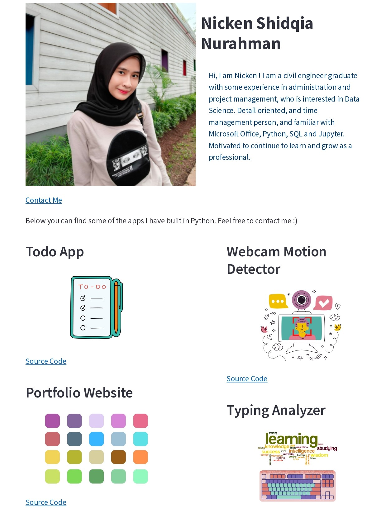
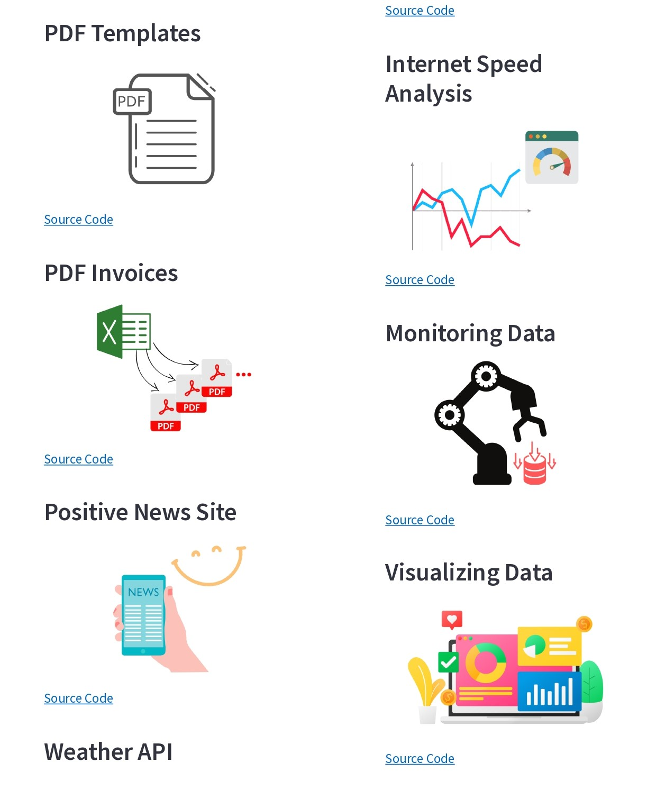
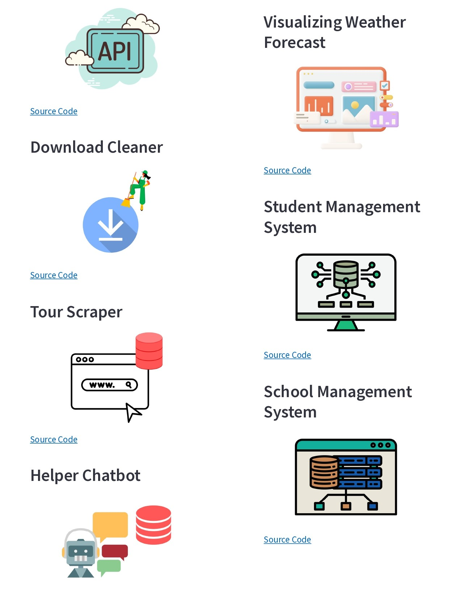
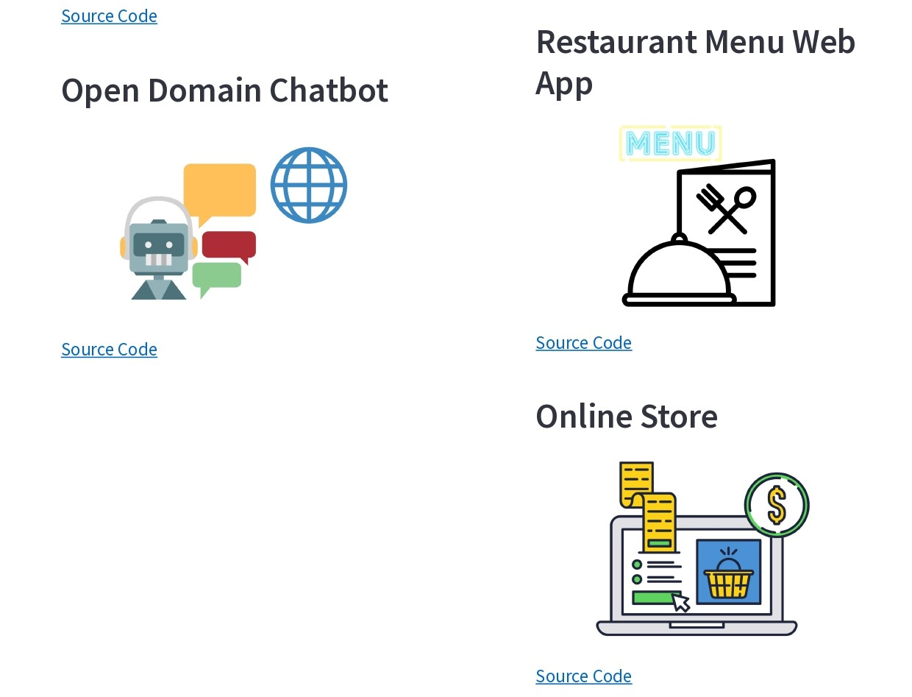

# Project Showcase Website with Python

## Project Description

**Overview :**  
The Project Showcase Website is a personal portfolio platform designed to showcase my various projects in a professional and visually appealing manner using Python.

**Challenges :**  
Build a project showcase website that allows users to easily navigate through the portfolio.

## Project Goal

Develop an intuitive and user-friendly interface that allows users to easily navigate through the portfolio and find relevant information

## Tools & Library Used

 &nbsp;

## Project Result

[Click here to get full code](https://github.com/nickenshidqia/Project_Showcase_Website_Using_Python/blob/51cfd7dbd18aca7c9fa89e7184a62766a800a09d/Home.py)  
[Click here to get PDF file](https://github.com/nickenshidqia/Project_Showcase_Website_Using_Python/blob/d480a0058c1a17c0398b12c34b696ec0db31c236/Project_Showcase_Website_Streamlit.pdf)

### Project Showcase Website

  
  
  
  
  
  

